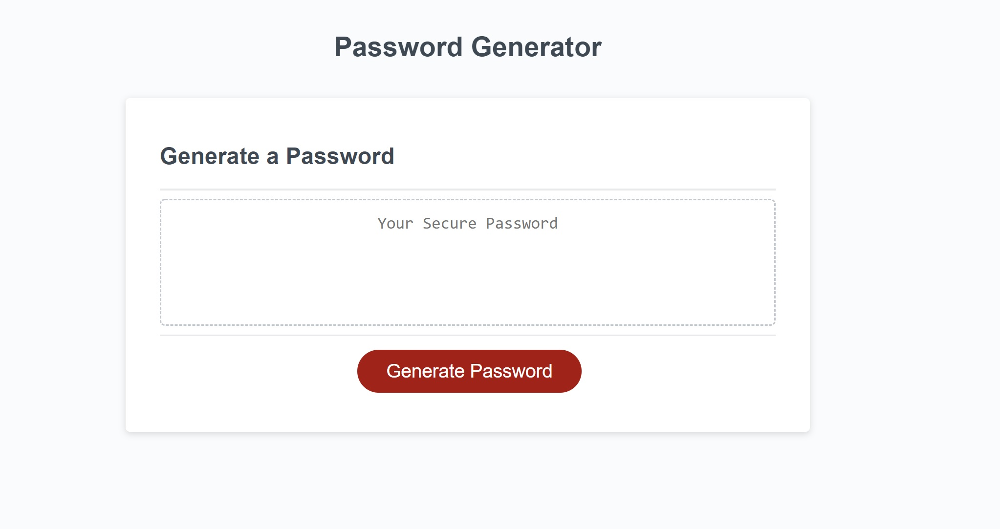
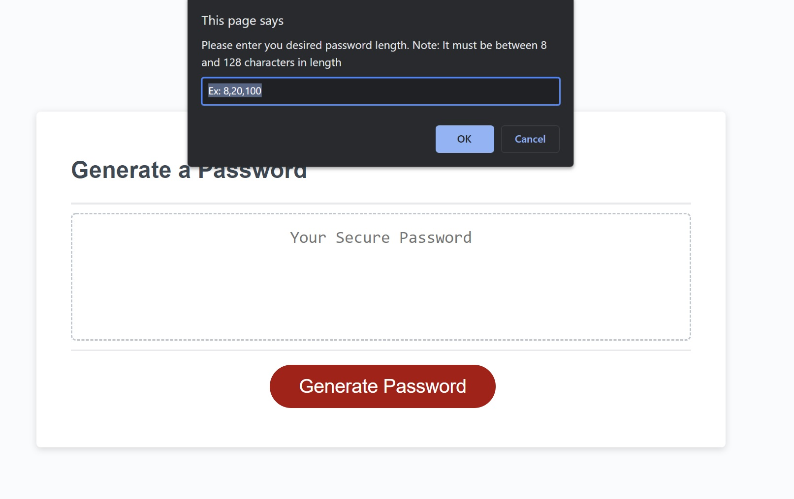
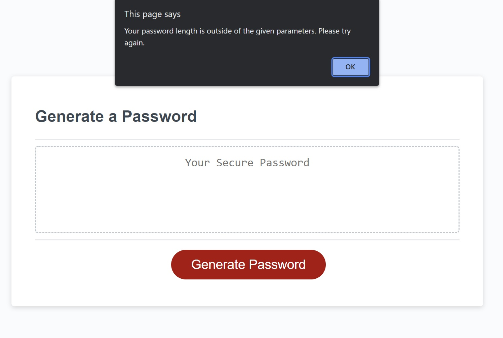
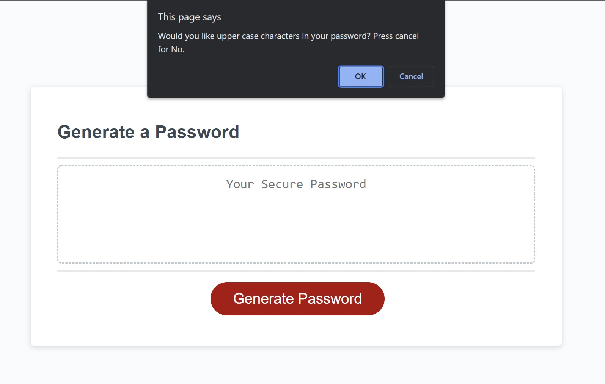
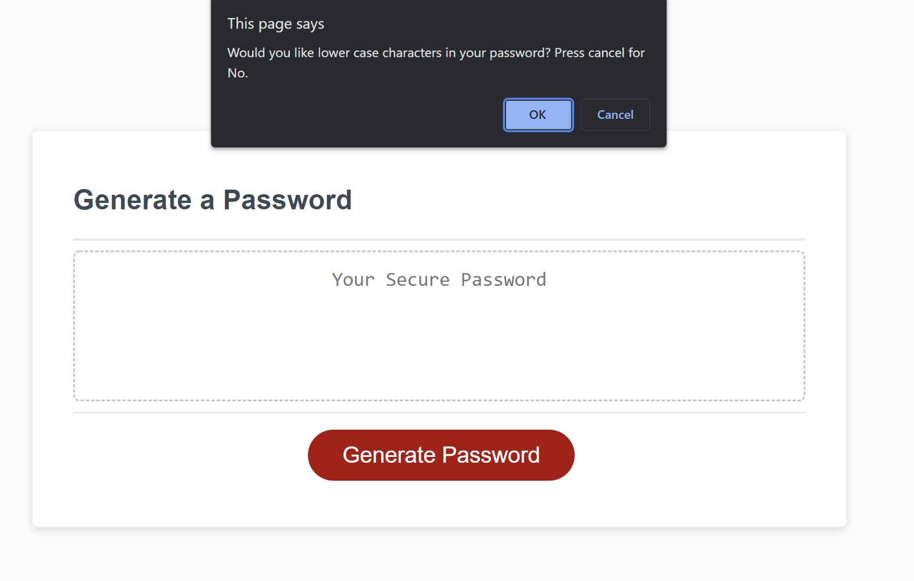
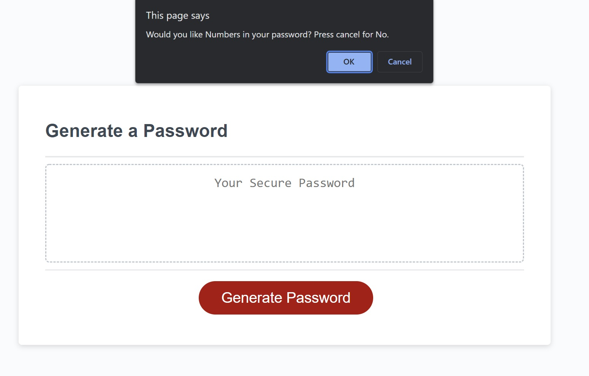
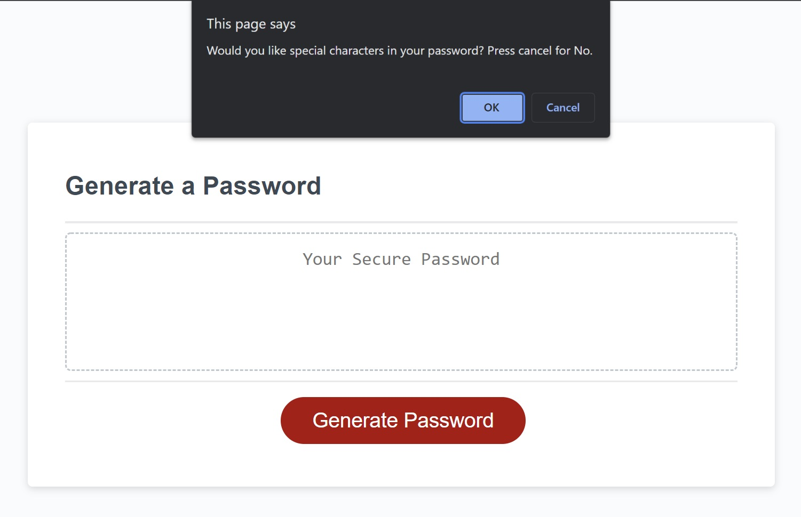
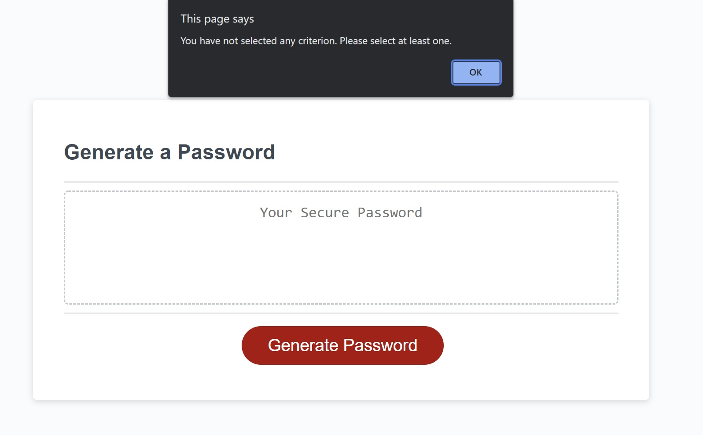
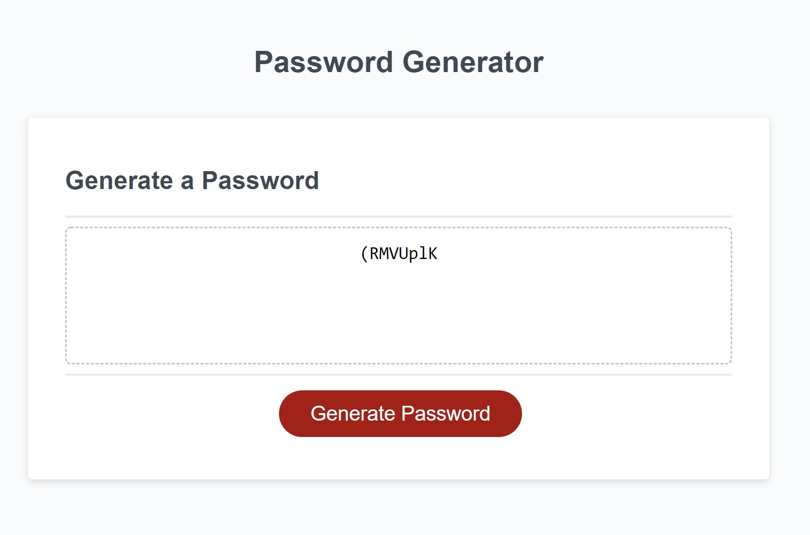

# hw-password-gen-js
Javascript Password Generator

##
This is a simple Password generator as the name suggests.

When you click on the "Generate Password" button a window will open asking you to input your desired password length. 

This password must be at minimum 8 characters and at maximum 128 characters. If outside these parameters it will give an error alert window.

After you enter a valid length a series of windows will open asking you if you'd like to include a type of characters to include in your password. They are upper case characters, lower case characters, numbers, and special characters like "@", "!", or, ")".

If you have not selected any character options the following window will appear to alert you that a password cannot be generated.

After you've made your choices your newly generated password will display in the text box above the Generate Password button.

